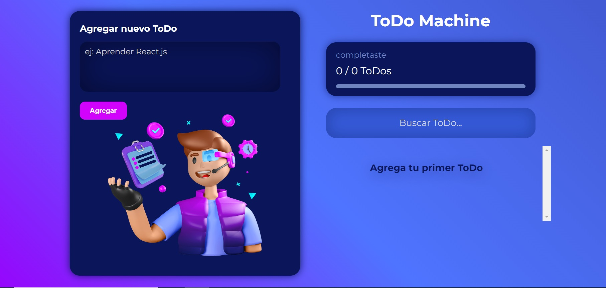

# ToDo Machine

ToDo Machine es una aplicación web desarrollada como parte de un curso de Platzi para aprender los conceptos básicos de React utilizando Create React App. ToDo Machine es una aplicación simple de lista de tareas que te permite agregar, completar y eliminar tareas.

TaskBuddy está alojado en GitHub Pages y se puede acceder a él a través de la siguiente URL: https://arielsa.github.io/ToDoMachine.

## Características

* Agregar tareas: Puedes agregar nuevas tareas a tu lista proporcionando el nombre de la tarea.
* Eliminar tareas: Puedes eliminar tareas de tu lista cuando ya no sean necesarias.
* Marcar tareas como completadas: Puedes marcar las tareas como completadas una vez que las hayas terminado.

## Requisitos
Antes de comenzar a utilizar TaskBuddy, asegúrate de tener instalado lo siguiente en tu entorno de desarrollo:

* Node.js: TaskBuddy utiliza Node.js para ejecutar el servidor de desarrollo y administrar las dependencias.
* npm: Es el administrador de paquetes de Node.js que se utiliza para instalar las dependencias de TaskBuddy.

